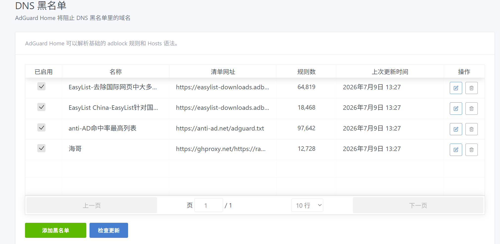

由刘淳本人整理的拦截规则和放行规则使用于Adguardhome，adblock格式
我的清单加上海哥的清单和anti-AD命中率最高列表，很不错，既不一刀切又放行了误拦截重要的cdn域名、如静态资源、图片等
相关的清单链接如下：

```
1、anti-ad             https://anti-ad.net/adguard.txt                                                                   
2、海哥的清单           https://ghproxy.net/https://raw.githubusercontent.com/2771936993/HG/main/hg1.txt                 
3、刘淳的拦截清单       https://ghproxy.net/https://raw.githubusercontent.com/GXLCLC/Ad-blocking-list/refs/heads/main/adlist    
```
<p align="center"><strong>如图</strong>
</p>



